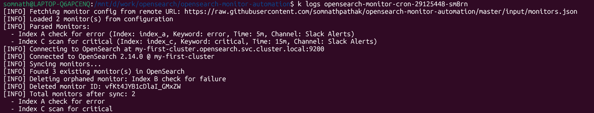

# OpenSearch Monitor Automation

Automates OpenSearch monitor management using scheduled jobs driven by a JSON configuration file.

## Table of Contents

1. [Overview](#1-overview)
2. [Assumptions](#2-assumptions)
3. [Input Format (JSON)](#3-input-format-json)
4. [How It Works](#4-how-it-works)
5. [Setup & Usage](#5-setup--usage)
6. [Scheduling (CronJob)](#6-scheduling-cronjob)
7. [OpenSearch Documentation Reference](#7-opensearch-documentation-reference)

---

## 1. Overview

This project automates the creation and deletion of OpenSearch monitors based on a single JSON input. It’s designed to run as a scheduled job (e.g., nightly), keeping monitor configurations in sync and reducing manual overhead.

## 2. Assumptions

- The JSON file provided (`monitors.json`) is the single source of truth for all expected OpenSearch monitors.
- Monitor names are unique and serve as the primary identifier for comparison.
- Existing monitors not listed in the JSON input will be deleted.
- If a monitor listed in the JSON already exists in OpenSearch with the same configuration, it will be skipped.
- The OpenSearch cluster is reachable and has required permissions to create and delete monitors.
- The script is intended to be run as a scheduled job (e.g., via Kubernetes CronJob or any CI scheduler).

## 3. Input Format (JSON)

The expected structure for `monitors.json` is:

```json
{
  "Monitors": [
    {
      "Monitor_Name": "Index A check for error",
      "Index": "index_a",
      "Text2Scan_in_Message": "error",
      "Time2Scan": "5m",
      "notification_channel": "notification_channel_1"
    },
    {
      "Monitor_Name": "Index B check for error",
      "Index": "index_b",
      "Text2Scan_in_Message": "error",
      "Time2Scan": "5m",
      "notification_channel": "notification_channel_2"
    }
  ]
}
```
| Field                   | Description                                                                  |
| ----------------------- | ---------------------------------------------------------------------------- |
| `Monitor_Name`          | Unique name for the monitor. Used as the identifier for create/delete logic. |
| `Index`                 | Target index (or index pattern) to scan in OpenSearch. Wildcards allowed.    |
| `Text2Scan_in_Message`  | String to search for in the document's `message` field.                      |
| `Time2Scan`             | Lookback window for the query (e.g., `5m`, `10m`).                           |
| `notification_channel` | Name of the notification channel configured in OpenSearch.                   |

>⚠️ Note: Monitor names must be unique and correspond to what the automation uses to detect additions/removals.

## 4. How It Works

The automation treats the `monitors.json` file as the single source of truth and performs the following actions during each run:

1. **Fetch existing monitors** from the OpenSearch cluster.
2. **Parse the input JSON** to get the desired list of monitors.
3. **Compare monitor names** to identify:
   - Monitors present in OpenSearch but not in JSON → marked for deletion.
   - Monitors present in JSON but not in OpenSearch → marked for creation.
   - Monitors present in both with the same configuration → skipped.
4. **Delete** any monitors not defined in the JSON.
5. **Create** new monitors as defined in the input file.

This ensures OpenSearch remains aligned with the desired state defined in the input.

### Example Execution Flow (based on [`input/monitors.json`](input/monitors.json))

The following walkthrough demonstrates the result of a complete automation run.

#### Monitor creation

The following monitors were created in OpenSearch from the input JSON configuration:

- Index A  
  

- Index B  
  

- Index C  
  

#### Monitor sync and deletion

On subsequent runs, the automation automatically removes any monitor not defined in the updated JSON.

- CronJob logs showing stale monitor deletion:  
  

- OpenSearch dashboard after deletion:  
  

#### Notification channel configuration

Each monitor is linked to a pre-configured Slack notification channel in OpenSearch:

- Notification channel setup in OpenSearch:  
  

#### Slack alert example

When a defined condition (e.g., "error" in logs) is met, the monitor triggers an alert:

- Alert message received in Slack:  
  

## 5. Setup & Usage

This section covers how to install OpenSearch locally, prepare the environment, and run the automation.

### OpenSearch Local Setup (via Minikube)

To quickly get started with OpenSearch, follow the official guide to install the OpenSearch Operator in a local Minikube environment:

- [OpenSearch Operator – Local Installation (Minikube)](https://docs.opensearch.org/docs/latest/tools/k8s-operator/#use-a-local-installation)

This setup creates the necessary CRDs, OpenSearch cluster, and dashboard UI accessible from your local machine.

Once deployed, you may need to port-forward the OpenSearch service to enable local access (if not already done via the guide):

```bash
kubectl port-forward svc/my-first-cluster 9200
```

### Running the Automation Script (Local)

Once your OpenSearch cluster is accessible (e.g., via port-forwarding on `localhost:9200`), you can run the automation locally:

```bash
python scripts/manage_monitors.py
```

By default:
- The script connects to OpenSearch at `localhost:9200` using username `admin` and password `admin`.
- It reads monitor definitions from the local file: `input/monitors.json`.

These defaults can be overridden using environment variables.

#### Overriding with Environment Variables

You can configure the script behavior using the following optional environment variables:

```bash
export OPENSEARCH_HOST=localhost
export OPENSEARCH_PORT=9200
export OPENSEARCH_USER=admin
export OPENSEARCH_PASS=admin
export MONITORS_URL=https://raw.githubusercontent.com/somnathpathak/opensearch-monitor-automation/master/input/monitors.json

python scripts/manage_monitors.py
```

#### Environment Variable Reference

| Variable          | Description                                  | Default                                      |
| ----------------- | -------------------------------------------- | -------------------------------------------- |
| `OPENSEARCH_HOST` | Host of the OpenSearch cluster               | `localhost`                                  |
| `OPENSEARCH_PORT` | Port for OpenSearch                          | `9200`                                       |
| `OPENSEARCH_USER` | OpenSearch username                          | `admin`                                      |
| `OPENSEARCH_PASS` | OpenSearch password                          | `admin`                                      |
| `MONITORS_URL`    | (Optional) Remote URL for monitor JSON input | *None* (falls back to `input/monitors.json`) |

### Running as a CronJob in Minikube

To run the automation on a schedule inside your Minikube-based OpenSearch setup, use the provided Kubernetes manifests.

#### Step 1: Create the OpenSearch Credentials Secret

Create a Kubernetes secret to store the OpenSearch username and password:

```bash
kubectl apply -f k8s/opensearch-creds.yaml
```

> ⚠️ For production environments, avoid hardcoding secrets. Instead, use secure options like [External Secrets Operator (ESO)](https://external-secrets.io/) or managed secret stores like AWS Secrets Manager or IBM Cloud Secrets Manager.

#### Step 2: Deploy the CronJob

Apply the CronJob manifest to schedule the monitor automation to run periodically:

```bash
kubectl apply -f k8s/cronjob.yaml
```

By default, the schedule is set to run daily at midnight (`0 0 * * *`). You can adjust this in the manifest for more frequent testing (e.g., every 2 minutes: `*/2 * * * *`).

The CronJob:

* Uses the Docker image `somnathpathak/opensearch-monitor:latest`
* Loads the monitor JSON from the provided `MONITORS_URL`
* Reads OpenSearch credentials from the `opensearch-creds` secret

### Dockerfile Used

The monitor automation is containerized using a lightweight Python image. The public image used in the CronJob is:

```
somnathpathak/opensearch-monitor:latest
```

This image is prebuilt and works out-of-the-box with the included `k8s/cronjob.yaml`. It uses `manage_monitors.py` as the container's entrypoint.

If you prefer to customize the logic or build the image privately (e.g., for internal registries), you can build and push it using:

```bash
docker build -t <your-registry>/opensearch-monitor:latest .
docker push <your-registry>/opensearch-monitor:latest
```

Update the `image` field in your CronJob manifest accordingly to reference the custom image.

### Ingesting Test Data (Optional)

Once the monitors have been successfully created, you can validate them by ingesting test log data into OpenSearch. This helps trigger alerts and confirm that your alert conditions and notification channels are working correctly.

Use the provided helper script:

```bash
./populate_test_data.sh
```

This script:

- Sends test log documents to three indices: `index_a`, `index_b`, and `index_c`
- Uses keywords like `error`, `failure`, and `critical` to simulate alert scenarios
- Inserts 10 timestamped documents per index using simple `curl` commands

Before running, ensure you have port-forwarding active to expose OpenSearch locally:

```bash
kubectl port-forward svc/my-first-cluster 9200 -n opensearch
```

> The script targets `https://localhost:9200` with basic auth (`admin`/`admin`). You can modify these defaults at the top of the script as needed.

After execution, you should see logs in the OpenSearch dashboard and, if configured correctly, Slack alerts for matching monitor conditions.

## 6. Scheduling (CronJob)

The monitor automation is designed to run as a scheduled job, ensuring OpenSearch stays in sync with the defined monitors over time.

### Default Scheduling Behavior

The included `cronjob.yaml` manifest runs the automation **once every day at midnight**:

```cron
0 0 * * *
```

This helps ensure any drift (e.g., deleted or newly added monitors in `monitors.json`) is automatically reconciled daily.

You can modify the schedule to match your desired frequency, for example:

* Every 2 hours: `0 */2 * * *`
* Every 5 minutes (for testing): `*/5 * * * *`

> The schedule follows standard [Cron format](https://kubernetes.io/docs/concepts/workloads/controllers/cron-jobs/#schedule-syntax). Make sure to adjust the schedule in `k8s/cronjob.yaml`.

## 7. OpenSearch Documentation Reference

For more details on the components used in this automation, refer to the official OpenSearch documentation:

- [OpenSearch Alerting](https://docs.opensearch.org/docs/latest/observing-your-data/alerting/index/)
- [Notification Channels in OpenSearch](https://docs.opensearch.org/docs/latest/observing-your-data/notifications/index/)
- [OpenSearch Python Client (Low-Level)](https://docs.opensearch.org/docs/latest/clients/python-low-level/)
- [OpenSearch REST API Reference](https://docs.opensearch.org/docs/latest/api-reference/)
- [OpenSearch Kubernetes Operator (Local Install)](https://docs.opensearch.org/docs/latest/tools/k8s-operator/#use-a-local-installation)
